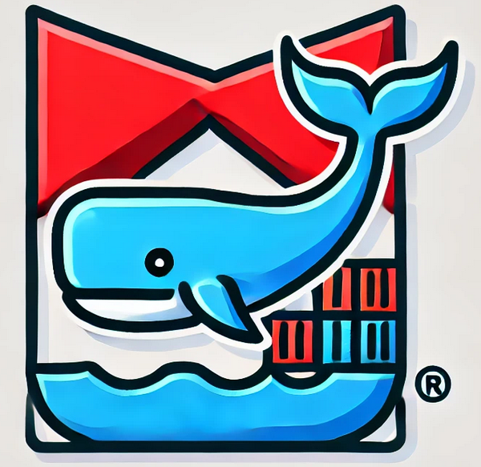

# Laravel dockerizado



Este proyecto permite desplegar a traves de contenedores docker los servicios necesarios para desplegar una aplicación con Laravel.

---

## 1. Requisitos previos

- Tener instalados:
  - Docker
  - Docker Compose
  - Git
  - Certificados SSL
- Conexión a Internet para descargar las imágenes y dependencias.

---

## 2. Configuración de acceso SSH

Para que funcione correctamente la conexión SSH con el servicio app_laravel, crea una clave ssh.

```bash
ssh-keygen -t rsa -b 4096 -C "tu_correo@example.com"
```

Esto generará dos archivos:

   - ~/.ssh/id_rsa (clave privada)
   - ~/.ssh/id_rsa.pub (clave pública)

Y copia la pública id_rsa.pub a la raíz del proyecto.

```bash
cp ~/.ssh/id_rsa.pub ./id_rsa.pub
```

Es recomendable eliminarla una vez se haya copiado al contenedor, aunque esto implicaría volver a copiarla si se quisieran regenerar los servicios.

Para conectarnos desde el anfitrión, simplemente tendremo que hacerlo con ssh:

```bash
ssh -i ~/.ssh/id_rsa laravel@localhost -p 2222
```

En caso de regenerar los contenedores, es posible que detecte el cambio y por seguridad no nos deje conectar. Para solucionarlo, solo hay que borrar el host de los ya conocidos:

```bash
ssh-keygen -f ~/.ssh/known_hosts -R '[localhost]:2222'
```

---

## 3. Certificados SSL

Los certificados SSL deben ubicarse en la carpeta `cert` del proyecto. Puedes usar OpenSSL para generar un certificado autofirmado.

```bash
mkdir -p certs
openssl req -x509 -nodes -days 365 -newkey rsa:2048 -keyout certs/apache-selfsigned.key -out certs/apache-selfsigned.crt
```

Para un entorno de producción, deberías obtener un certificado SSL de una autoridad de certificación (CA) confiable, como Let's Encrypt.

## 4. Construir y levantar los servicios

Crea en la raíz de tu proyecto la carpete `src` para sincronizar con el código de Laravel del contenedor.

```bash
mkdir src
```

Establece los permisos adecuados:

```bash
sudo chmod -R 770 src
sudo chown -R www-data:$USER src
```

Es posible que si no tienes suficientes permisos en tu equipo anfitrión, tengas que adaptar lo anterior a tu entorno. Para un entorno de pruebas, puedes asignar permisos totales sobre la carpeta. Podrías necesitar volver a hacerlo después de la instalación.

```bash
chmod -R 777 src
```

Ejecuta los siguientes comandos para construir y levantar los servicios:

```bash
docker compose build
docker compose up -d
```

Al crear la imagen del contenedor de Laravel, se crea un usuario `laravel:devTest-.,` con el que conectarse por ssh y dentro del grupo sudo.

Verifica que los contenedores están corriendo:

```bash
docker ps
```

---

## 5. Instalación de Laravel

### Creación de proyecto

1. Accede al contenedor de la aplicación:

```bash
ssh -i ~/.ssh/id_rsa laravel@localhost -p 2222
```

2. Instala Laravel usando Composer:

```bash
cd /var/www/html/
composer create-project --prefer-dist laravel/laravel . "^11.0"
```

No es necesario crear la base de datos SQLite. Editaremos la configuración más adelante.

### Configuración Apache y permisos

Verifica que está correctamente configurado Apache para apuntar a la carpeta pública de Laravel. Fichero `/etc/apache2/sites-available/000-default.conf`:

```xml
<VirtualHost *:80>
    ServerAdmin webmaster@localhost
    DocumentRoot /var/www/html/public

    <Directory /var/www/html/public>
        Options Indexes FollowSymLinks
        AllowOverride All
        Require all granted
    </Directory>

    ErrorLog ${APACHE_LOG_DIR}/error.log
    CustomLog ${APACHE_LOG_DIR}/access.log combined
</VirtualHost>

<VirtualHost *:443>
    ServerAdmin webmaster@localhost
    DocumentRoot /var/www/html/public

    SSLEngine on
    SSLCertificateFile /etc/ssl/certs/apache-selfsigned.crt
    SSLCertificateKeyFile /etc/ssl/private/apache-selfsigned.key

    <Directory /var/www/html/public>
        Options Indexes FollowSymLinks
        AllowOverride All
        Require all granted
    </Directory>

    ErrorLog ${APACHE_LOG_DIR}/error.log
    CustomLog ${APACHE_LOG_DIR}/access.log combined
</VirtualHost>
```

### Configuración de variables de entorno

La instalación crea un archivo `.env` en src. Debemos cambiar la configuración a nuestro gusto. Lo más importante es indicar la conexión con la base de datos.

```env
DB_CONNECTION=mysql
DB_HOST=db
DB_PORT=3306
DB_DATABASE=laravel
DB_USERNAME=laravel
DB_PASSWORD=devtest
```

### Finalizar la instalación

Para usar `php artisan`, accede al contenedor:

```bash
ssh -i ~/.ssh/id_rsa laravel@localhost -p 2222
```

Y ejecuta los siguientes pasos para finalizar la instalación:

```bash
cd /var/www/html
php artisan migrate
php artisan key:generate
```

Accede a `http://localhost` y `https://localhost` para comprobar que puedes visualizar correctamente la página inicial de Laravel.

## 6. Limitaciones

### Xdebug

Las vistas Blade en Laravel son compiladas en archivos PHP antes de ser servidas, lo que puede hacer que la depuración directa en los archivos .blade.php no funcione como se espera. Sin embargo, puedes depurar el código PHP en las vistas Blade utilizando los archivos PHP que se almacenan en el directorio storage/framework/views. Puedes encontrar el archivo compilado correspondiente a tu vista y colocar puntos de interrupción allí. Sin embargo, esta no es la forma más práctica de depurar.

